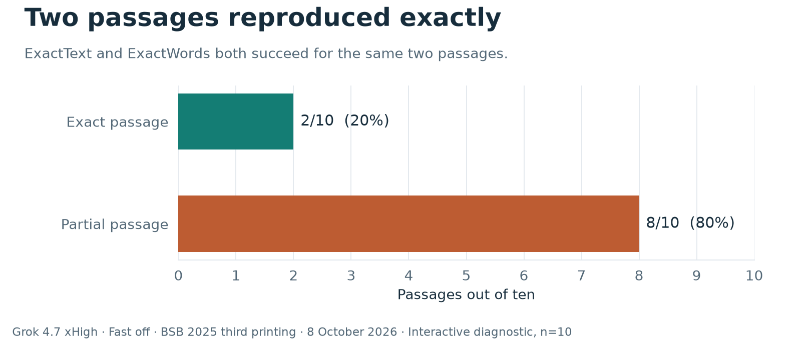
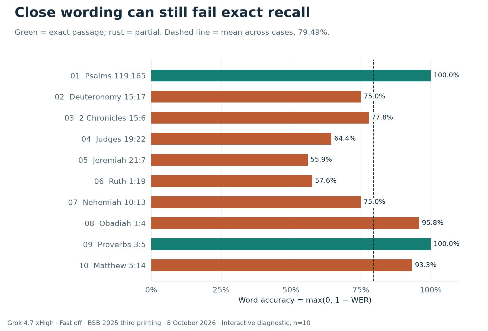
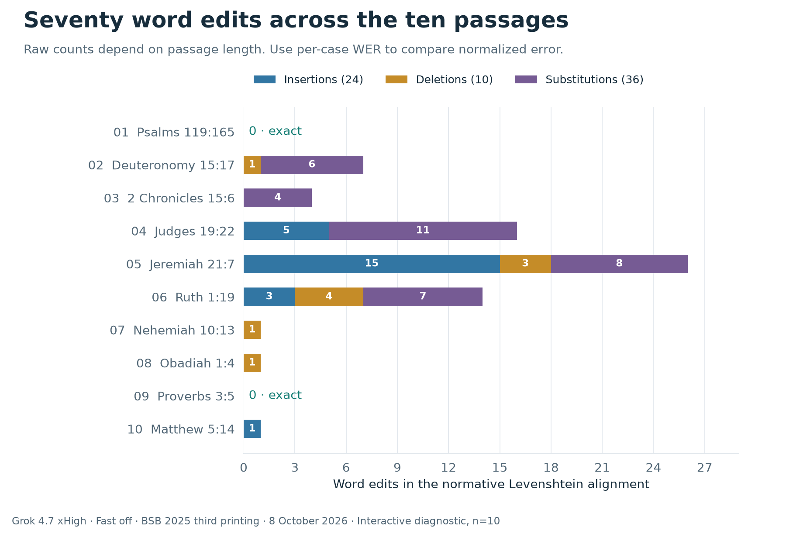
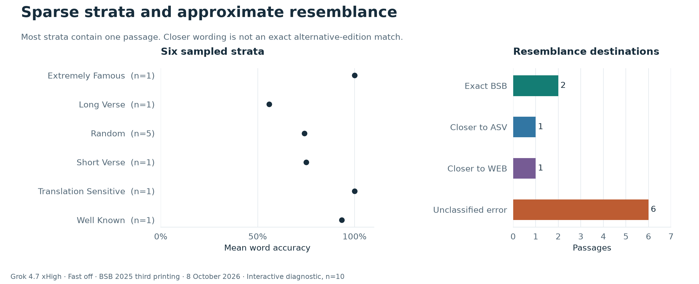

# First Grok 4.7 xHigh trial through Cursor CLI

On **8 October 2026**, Grok 4.7 xHigh reproduced **2 of 10 BSB passages exactly**
through the Cursor CLI. ExactText and ExactWords were both **20%**. Mean per-case
word accuracy was **79.49%**, with eight partial passages and no recorded refusals
or provider errors. The CLI selected **Extra High reasoning with Fast off**.

This is a live **interactive diagnostic** on public development cases, with one
answer per reference in a shared conversation. It is not a controlled provider
comparison, a hidden evaluation, or an estimate of accuracy across the Bible.
No additional model calls were made to prepare this publication.

[Open the offline case explorer](index.html) · [Full passage comparisons](case-details.md)
· [Case metrics CSV](case-metrics.csv) · [Original machine report](report.json)

Download `index.html` and open it in a browser to use its filters, metric selector,
appearance toggle, and passage comparison. Its charts and data are embedded; it
works without a server, internet connection, or credentials. GitHub itself displays
the HTML source. Filters affect the case list; headline rates remain for all ten
cases. Highlights are illustrative whitespace-word differences, distinct from
the normative Rust scorer. Printing includes the currently selected passage;
the Markdown comparison file includes all ten. Companion documentation and data
links need the adjacent archive files; the explorer and charts work from the HTML
file alone.

## Outcomes and metric definitions



[Vector SVG](figures/outcomes.svg) · [High-resolution PNG](figures/outcomes.png)

| Measure | Observed result | Denominator or meaning |
| --- | ---: | --- |
| ExactText | 2 / 10 = **20%** | Whole passages identical after transport normalization |
| ExactWords | 2 / 10 = **20%** | Whole case-sensitive word sequences identical |
| Mean word accuracy | **79.4896849854477%** | Arithmetic mean of ten `max(0, 1 − WER)` values |
| Mean word error rate (WER) | **20.5103150145523%** | Arithmetic mean of ten word edit rates |
| Mean character error rate (CER) | **16.0807989338177%** | Arithmetic mean of ten character edit rates |
| Partial passages | **8 / 10** | Non-exact submitted passage text |
| Refusals | **0 / 10** | Recorded refusal classification |
| Provider errors | **0 / 10** | Recorded provider error classification |
| Extraneous text | **0 / 10** | Scorer's extraneous-output diagnostic |
| Exact alternative-edition confusion | **0 / 10** | Exact match to another catalogued edition |
| Word edit totals | **24 insertions, 10 deletions, 36 substitutions** | 70 edits across all ten alignments |

The [scoring contract](../../SCORING.md) is authoritative. ExactText normalizes
Unicode to NFC and CRLF/CR line endings to LF; spaces, capitalization, and
punctuation remain significant. ExactWords compares case-sensitive Unicode word
sequences, ignoring punctuation and equating internal straight/curly apostrophes.
WER and CER use Levenshtein edit distance divided by the reference word or
character count. Word accuracy is `max(0, 1 − WER)`.

The 79.49% figure averages case-level word accuracy; it is not the proportion of
passages quoted exactly, a probability of a correct answer, or a pooled token
accuracy. Longer passages do not receive more weight in this mean. Both exact
metrics succeed for the same two cases. Every partial case has at least one
word-level error, so these failures cannot be explained by punctuation alone.
Zero observed refusals or tool misuse in ten cases does not establish a general
zero rate.

## Setup and sampling

| Setting | Recorded value |
| --- | --- |
| Run ID | `grok47-xhigh-cursor-20261008-01` |
| Date/time | 2026-10-08, 11:12:49–approximately 11:20:08.250 UTC |
| Local time | 13:12:49–approximately 13:20:08.250 CEST, Europe/Berlin |
| Successful-launch elapsed time | **439.25 seconds** (7 minutes 19.25 seconds) |
| Cursor CLI version | `2026.10.01-e373342` |
| Requested CLI slug | `grok-4.7-xhigh` |
| Native CLI selection label | `Grok 4.7 256K Extra High` |
| Native model parameters | `modelId=grok-4.7`, `context=256k`, `reasoning_effort=xhigh`, `fast=false` |
| Service-resolved model identity | Not returned / independently unresolved |
| BibleQuoteBench engine | `0.2.0` |
| Source commit | [`2cde230`](https://github.com/x4g4p3x/BibleQuoteBench/commit/2cde230ee8b84986415b7646136bbb3d17e5e650) |
| Evidence | `interactive_mcp`; trial schema 2; self-reported model identity |
| Edition | `bsb-2025-third-printing` |
| Prompt variant | `canonical` for every case |
| Selection | `stratified_reference_v1`, limit 10 |
| Selection seed | `BibleQuoteBench/MCP/stratified-v1` |
| Repetitions | One answer per case, one completed trial |
| Sampling temperature / output ceiling | Client defaults; not independently verified |

The deterministic MCP sampler selected ten distinct references from the public
development corpus and preserved their presentation order. Five were in the
`random` stratum; each of the other five sampled strata contributed one reference.
Stratum names are existing dataset annotations, not findings about how familiar
these verses were to Grok. This small selection does not reproduce the full
development distribution or provide hidden-test protection.

An operator started the fixed run before handing orchestration to Cursor. The
assistant first checked status, then alternated `next_case` and `submit_answer`,
and requested `finish_run` after submitting all ten answers. It was instructed
to quote from internal recall, preserve the requested edition, submit only passage
text, and never revise an accepted answer. An empty submission was permitted if
no passage text could be recalled. The exact orchestration instructions are
retained in [provenance.json](provenance.json). Each server-issued canonical prompt
specified the requested reference and edition. See [cases.jsonl](cases.jsonl) and
the [canonical prompt renderer](../../../src/prompt.rs).

All ten cases share the same Cursor conversation. Previously issued prompts and
answers can therefore influence subsequent answers. The MCP server keeps its
reference corpus evaluator-only; the model receives the case prompt, not the
reference text. Scoring feedback was deferred until completion.

## Results by passage



[Vector SVG](figures/case-accuracy.svg) · [High-resolution PNG](figures/case-accuracy.png)

Rows follow presentation order. Exact status applies to both ExactText and
ExactWords. Percentages below are rounded to two decimals; JSONL records retain
the original numeric precision. I/D/S denote insertions/deletions/substitutions.

| # | Reference | Stratum | Exact? | Word accuracy | WER | CER | I / D / S |
| ---: | --- | --- | --- | ---: | ---: | ---: | ---: |
| 1 | Psalms 119:165 | translation_sensitive | Yes | 100.00% | 0.00% | 0.00% | 0 / 0 / 0 |
| 2 | Deuteronomy 15:17 | random | No | 75.00% | 25.00% | 17.36% | 0 / 1 / 6 |
| 3 | 2 Chronicles 15:6 | random | No | 77.78% | 22.22% | 21.21% | 0 / 0 / 4 |
| 4 | Judges 19:22 | random | No | 64.44% | 35.56% | 29.88% | 5 / 0 / 11 |
| 5 | Jeremiah 21:7 | long_verse | No | 55.93% | 44.07% | 33.96% | 15 / 3 / 8 |
| 6 | Ruth 1:19 | random | No | 57.58% | 42.42% | 28.34% | 3 / 4 / 7 |
| 7 | Nehemiah 10:13 | short_verse | No | 75.00% | 25.00% | 20.00% | 0 / 1 / 0 |
| 8 | Obadiah 1:4 | random | No | 95.83% | 4.17% | 4.00% | 0 / 1 / 0 |
| 9 | Proverbs 3:5 | extremely_famous | Yes | 100.00% | 0.00% | 0.00% | 0 / 0 / 0 |
| 10 | Matthew 5:14 | well_known | No | 93.33% | 6.67% | 6.06% | 1 / 0 / 0 |

Several cases show why a high word-accuracy score does not guarantee a usable
verbatim quotation:

- **Nehemiah 10:13:** expected `Hodiah, Bani, and Beninu.`; submitted
  `Hodiah, Bani, Beninu,`. Omitting `and` is one deletion against four reference
  words, producing 25% WER. Punctuation differs as well.
- **Obadiah 1:4:** the requested wording includes `even from there`; the answer
  has `from there`. That single missing word leaves 95.83% word accuracy while
  failing both exact metrics.
- **Matthew 5:14:** expected `A city on a hill`; submitted `A city set on a hill`.
  The added `set` is one insertion, leaving 93.33% word accuracy and an exact failure.
- **Deuteronomy 15:17:** the ending changes from `And treat your maidservant the
  same way.` to `Do the same for your maidservant.` The saved alignment records
  six substitutions and one deletion over the whole passage.
- **2 Chronicles 15:6:** `God afflicted them with all kinds of adversity.` becomes
  `God troubled them with every kind of distress.` Four word substitutions remain
  after alignment.
- **Judges 19:22, Jeremiah 21:7, and Ruth 1:19:** more extensive substitutions,
  additions, or omissions change the requested wording. Jeremiah has the largest
  word edit count (26) and lowest word accuracy (55.93%) in this sample.
- **Psalms 119:165 and Proverbs 3:5:** both the words and punctuation match the
  reference under the scorer's transport normalization.

The [full comparison appendix](case-details.md) shows every expected passage and
every actual answer. These textual observations do not evaluate semantic adequacy,
theological correctness, or the cause of Grok's wording choices.

## Edit distribution



[Vector SVG](figures/word-edits.svg) · [High-resolution PNG](figures/word-edits.png)

There are 70 word edits in the saved alignments: 24 insertions, 10 deletions, and
36 substitutions. Raw counts depend on reference length. Jeremiah 21:7 contributes
26 edits, Judges 19:22 contributes 16, and Ruth 1:19 contributes 14. Three passages
fail with only one word edit each. Use WER to compare errors relative to passage
length, and ExactText to assess a complete verbatim quotation.

The edit counts come from the Rust scorer's normative alignment. Viewer highlights
use a separate whitespace-token alignment for readability. Punctuation can affect
those highlights without adding a normative word edit, and alternative optimal
alignments can divide operations differently without changing total distance.

## Strata and alternative editions



[Vector SVG](figures/diagnostics.svg) · [High-resolution PNG](figures/diagnostics.png)

| Sampled stratum | Cases | Exact passages | Mean word accuracy |
| --- | ---: | ---: | ---: |
| extremely_famous | 1 | 1 / 1 | 100.00% |
| long_verse | 1 | 0 / 1 | 55.93% |
| random | 5 | 0 / 5 | 74.13% |
| short_verse | 1 | 0 / 1 | 75.00% |
| translation_sensitive | 1 | 1 / 1 | 100.00% |
| well_known | 1 | 0 / 1 | 93.33% |

Five stratum means are individual observations. Neither the two 100% rows nor the
five random-case failures establish a general pattern. The chart intentionally
shows sample sizes and no confidence intervals or significance claims.

The scorer compares answers with the requested BSB text and available ASV/WEB
alternatives for the same reference. The requested-to-resembles destinations are:

| Destination | Count | Interpretation |
| --- | ---: | --- |
| Requested BSB | 2 | Exact requested-edition passages |
| Closer to ASV 1901 | 1 | Nehemiah 10:13; approximate resemblance |
| Closer to WEB Classic 2020 | 1 | Jeremiah 21:7; approximate resemblance |
| Unclassified error | 6 | Remaining non-exact passages without a strictly closer alternative |

There are **zero exact alternative-edition matches** and thus zero recorded
translation-confusion classifications. Being closer to ASV or WEB is a distance
diagnostic; it is not proof of quoting that edition, using retrieval, or learning
from that source. Available alternatives are limited to the catalogued texts.

## Tool-use restrictions and observed audit

Cursor ran in a fresh temporary workspace with an isolated home/configuration and
only the `biblequotebench` MCP server. Overriding only `CURSOR_CONFIG_DIR` was
insufficient to exclude the normal global MCP configuration; the successful
launch also isolated `HOME` and `USERPROFILE`. The settings denied:

```text
Shell(*)
Read(**)
Write(**)
WebFetch(*)
WebSearch(*)
Mcp(biblequotebench:begin_trial)
Mcp(biblequotebench:resume_trial)
```

Only `benchmark_status`, `next_case`, `submit_answer`, and `finish_run` were allowed
for this server, plus schema discovery. The launch used `--trust --approve-mcps`
and did not enable force/yolo behavior. It did not use ask mode, which can filter
out the state-changing benchmark tools needed to submit an answer. The operator
watched the streamed transcript and checked the saved responses against submitted
tool arguments after completion.

| Observed operation | Unique call IDs |
| --- | ---: |
| Benchmark schema discovery | 1 |
| `benchmark_status` | 1 |
| `next_case` | 11 (ten issued prompts plus completion check) |
| `submit_answer` | 10 |
| `finish_run` | 1 |
| Non-benchmark retrieval, shell, file, or delegation tools | 0 |

The transcript contains 24 raw MCP tool-start events but 23 unique MCP call IDs,
plus the one discovery call. One start event repeats the same call ID with
identical arguments; it is counted once rather than interpreted as an extra
answer. Ten unique answer submissions matched the ten saved response outputs.

An initial launch was stopped during permitted schema discovery because the
operator's transcript guard mistook envelope metadata for tool names. It issued
**zero benchmark cases** and submitted **zero answers**. Its audit records were
preserved, the watcher was corrected, and the successful launch used the untouched
trial. No accepted answer was rerun, revised, or selected from multiple attempts.
Account usage from that initial aborted launch is unknown.

These restrictions and the observed transcript support the statement **no
retrieval was observed**. They do not prove service-side tool suppression or an
independent zero-tool request boundary for Grok. The repository's authoritative
request gate currently applies to the separate [restricted Codex runner](../../RESTRICTED.md),
whose answering model is a Codex model. It was not used to generate these Grok
answers. This archive therefore retains `interactive_mcp` and the original
self-reported model label; it is not upgraded to `restricted_codex` or controlled
provider evidence.

Temporary-workspace cleanup was rejected by automatic approval policy after the
trial. That workspace remains local. This does not change the saved answers;
private client configuration is excluded from this publication.

## Authentication, usage, and cost boundaries

The CLI used Cursor browser-login authentication. No provider API keys were
supplied, and environment variables ending in `API_KEY` were removed for the
launch. The benchmark made **zero paid provider API calls**. Cursor account usage
was consumed; this should not be read as a claim that running Grok is free or
does not affect a Cursor allowance.

The successful CLI result reported these aggregate values:

| CLI usage field | Reported tokens |
| --- | ---: |
| Input | 11,099 |
| Output | 5,214 |
| Cache read | 320,000 |
| Cache write | 0 |

These fields describe the successful launch as returned by Cursor. They are not
per-verse usage, an independently measured billing ledger, or a breakdown of
reasoning tokens. Cache-read tokens reflect reused context and must not be
interpreted as 320,000 distinct Bible words. No price, invoice, total cost, or
per-case latency was independently verified. The 439.25 seconds include
orchestration, tool round trips, and answering; they are not a pure inference-time
measurement. No new paid run was required to rescore or visualize the archive.

## Public artifacts and integrity

| File | Contents |
| --- | --- |
| [cases.jsonl](cases.jsonl) | Ten public canonical BSB cases in presentation order |
| [references.jsonl](references.jsonl) | 30 reference texts: BSB, ASV, and WEB for each selected anchor |
| [catalog.json](catalog.json) | Edition metadata and redistribution flags |
| [responses.jsonl](responses.jsonl) | All ten raw submitted passage answers |
| [scores.jsonl](scores.jsonl) | Unmodified saved Rust score rows and response-output hashes |
| [report.json](report.json), [report.md](report.md) | Original descriptive machine reports |
| [trial.json](trial.json) | Original trial identity, selection, evidence, and commitments |
| [provenance.json](provenance.json) | Sanitized launch selection, audit, usage, and limitations |
| [case-metrics.csv](case-metrics.csv) | Flat case metrics for external inspection |
| [case-details.md](case-details.md) | All expected and submitted passages with case-level scores |
| [index.html](index.html) | Self-contained offline charts and case explorer |
| [figures/](figures/) | Four vector SVG and four 180-DPI PNG figures |
| [figure-hashes.json](figure-hashes.json) | Byte SHA-256 digests of the HTML and eight figure files |

The catalog marks all three published editions as `public_domain` with
`redistribute_reference_text: true`. Only public `BQ-DEV-` cases are included.
The 30-text subset retains all catalogued alternatives needed to reproduce this
sample's alternative-edition diagnostics. No hidden cases or hidden seed are
published. Raw Cursor thinking, session/request identifiers, account metadata,
local machine paths, and temporary client files remain private.

**Digest scope matters.** The original `trial.json` reference commitment binds
the full development corpus used by the evaluator, not this smaller published
30-record subset. Its case commitment covers the selected ten cases; prompt,
catalog, response, and score commitments retain their original meanings. These
are the benchmark's typed serialization commitments, not necessarily hashes of
the pretty-printed file bytes. The original commitments have not been rewritten
to imply that the subset was the original full corpus. `figure-hashes.json`
separately hashes generated file bytes.

The original private transcript's SHA-256 is
`2cb1567dc9be8c8b9b60a05c2fdf44074fdd6259d0430825193f601230bea863`.
The selected CLI bundle's SHA-256 is
`0e7e28c34e050c6b83fe574e1fefa8d95d7c80bea6c4a4d3ae2726e5191243ef`.
Both are recorded in sanitized provenance. Hashes provide integrity commitments;
they are not provider signatures or proof of model identity. External readers
can independently verify scoring from the public answers but cannot replay or
independently inspect the unpublished transcript from its digest alone.

The original trial has generic limitations stating that sampling settings and
usage are unknown. Supplementary provenance records the native CLI model
selection and successful-launch aggregate usage discovered during the audit;
this adds client evidence while leaving service-side sampling defaults and
model resolution unverified.

## Reproduce scoring without model calls

From the repository root, these commands score the published reference subset
and write fresh outputs to the ignored `results` directory:

```console
cargo run --locked -- score --translations docs/trials/2026-10-08-grok47-xhigh-cursor/catalog.json --cases docs/trials/2026-10-08-grok47-xhigh-cursor/cases.jsonl --references docs/trials/2026-10-08-grok47-xhigh-cursor/references.jsonl --responses docs/trials/2026-10-08-grok47-xhigh-cursor/responses.jsonl --output results/grok47-rescored.jsonl
cargo run --locked -- summarize --scores results/grok47-rescored.jsonl
cargo run --locked -- report --scores results/grok47-rescored.jsonl --markdown results/grok47-rescored.md --json results/grok47-rescored.json
```

Every freshly scored row matched this archive as parsed JSON. The aggregate
report's counts and categories matched; floating-point metrics agreed within
`1e-15`. Reloading serialized scores changes the single-case `well_known` mean
from `0.9333333333333333` to `0.9333333333333332`, with no effect on any displayed
percentage. The original report is preserved. This validates the published subset
for the observed answers;
it does not recreate the original full-corpus reference commitment. The ordinary
`summarize` and `report` commands are descriptive. `analyze` requires controlled
manifests and should not be used by fabricating one for interactive evidence.

To regenerate the four figures, offline explorer, and full comparison appendix,
install the pinned plotting dependencies in a local environment. The publication
was generated with Python 3.14.0 and Matplotlib 3.11.2 on Windows:

```powershell
python -m venv results/trial-report-runtime
./results/trial-report-runtime/Scripts/python.exe -m pip install -r scripts/trial-report-requirements.txt
./results/trial-report-runtime/Scripts/python.exe scripts/render-trial-report.py
```

On other platforms use the corresponding virtual-environment Python executable
(usually `results/trial-report-runtime/bin/python`). Rendering makes no model or
network calls; initial dependency installation may download packages. The
[renderer](../../../scripts/render-trial-report.py) and
[HTML template](../../../scripts/trial-dashboard.html) are specific to this
archived trial and reject a different run or incompatible outcomes. They are
separate from the controlled-analysis visualizer. Repeated generation produced
identical HTML, appendix, PNG, and SVG bytes in the pinned environment; exact
bytes across different platforms or dependency versions are not guaranteed.

An actual new model trial is a separate operation that consumes Cursor usage.
Use a new run ID, verify that the current CLI offers `grok-4.7-xhigh` with Fast
off, isolate its client configuration, and preserve a fresh audit. Do not resume
or overwrite this completed trial as if it were a new repetition. The
[MCP workflow](../../MCP.md) describes how to start another interactive trial.
Availability of a CLI alias and the behavior of its permissions can change.

## Interpretation and next evidence needed

This run demonstrates an end-to-end subscription-client route: case issuing,
internal-recall instructions, answer capture, deterministic scoring, and public
result reproduction all completed without benchmark provider API calls. The
answers also demonstrate that mostly familiar-looking wording can still be
unreliable for a requested verbatim edition.

The evidence is limited by ten development references, one edition, no repeated
runs, shared conversation context, client defaults, unresolved service identity,
and the lack of an authoritative Grok zero-tool gate. There is no paired baseline,
confidence interval, general model ranking, inferred training provenance, or
claim about future model behavior. The held paid GPT-6 pilot is unchanged.

A stronger future evaluation would use a documented larger selection, balanced
edition coverage, independent repetitions, stable model/version settings,
separate per-case context, and a verifiable answering boundary. Until Grok has an
equivalent request gate, retain the interactive evidence label even when the
transcript shows no external tools. These are proposals for later work; no such
additional runs were performed for this report.
