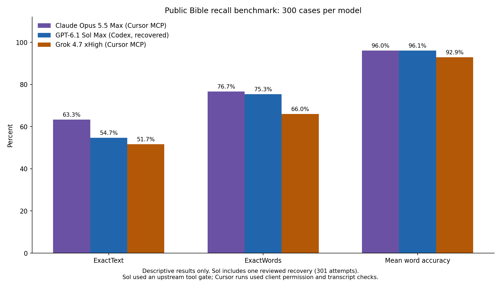

# Public recall accuracy: 300 cases per model

These subscription runs completed on October 8–9, 2026, in Europe/Berlin time.
Each model answered the same 100 public development references in three pinned
editions: ASV 1901, BSB 2025 third printing, and WEB Classic 2020. This gives
300 cases per model, grouped around 100 shared references.



## Reading the chart

- **ExactText:** the entire answer matches the reference after transport line-ending
  and Unicode normalization. Capitalization, punctuation and whitespace matter.
- **ExactWords:** case-sensitive word sequences match, with punctuation ignored.
- **Mean word accuracy:** the mean of `max(0, 1 - WER)` across the 300 cases,
  using word-level Levenshtein alignment.

The [scoring contract](../../SCORING.md) defines the metrics precisely. This is
one observed run per model on the public development set. The figure reports
descriptive results, without confidence intervals or a hidden-set evaluation.

## Execution methods

Grok 4.7 xHigh and Claude Opus 5.5 Max used native Cursor CLI with subscription
login, Fast disabled, and the benchmark MCP tools. Each case used a fresh
conversation. Client permissions and a live transcript guard prohibited browsing,
file retrieval and unrelated tools. First accepted answers were immutable.
Their evidence remains `interactive_mcp`: client selection and observed tool
activity were checked, while upstream model identity and effective sampling
defaults were not independently verified.

GPT-6.1 Sol Max used native Codex CLI with ChatGPT subscription login and the
[restricted runner](../../RESTRICTED.md). Its authoritative request gate checked
model and effort selection, an empty tool schema, disabled tool choice and no
conversation history. Codex desktop coordinated the runs and validation.

Sol's plotted result is the recovered 300-answer result: 301 generation attempts
included one interrupted attempt and a reviewed recovery through a separate
source. A separate first-attempt projection is retained by the evaluator. The
recovery did not change its exact-match totals, but did affect mean word accuracy.

For Claude, two invocations attempted to change a previously submitted answer.
The guard stopped them; manual review retained the unchanged first answer from
each immutable checkpoint. One had a client acceptance acknowledgement; the
other had durable-checkpoint evidence with acceptance timing unverified. Repeated
case retrievals and identical resubmissions were checked separately. No issued
Claude case was regenerated.

The different clients, tool controls, recovery histories and provider defaults
limit interpretation. Highest available effort does not imply equal reasoning
budgets. The chart compares these model-and-client runs, rather than establishing
a controlled ranking under matched execution conditions.

## Figure integrity

The PNG is the original accuracy comparison produced for the completed runs.
Its values were checked against the three preserved aggregate reports, each
covering 300 unique cases with the same case selection. Raw answers and detailed
execution audits remain in the private evaluator archive.

SHA-256 of [the figure](accuracy-comparison.png):

```text
4bc9ceec0f2c45370db205c48476f924155cf410d63f0e4a7583bc18f5a30147
```
